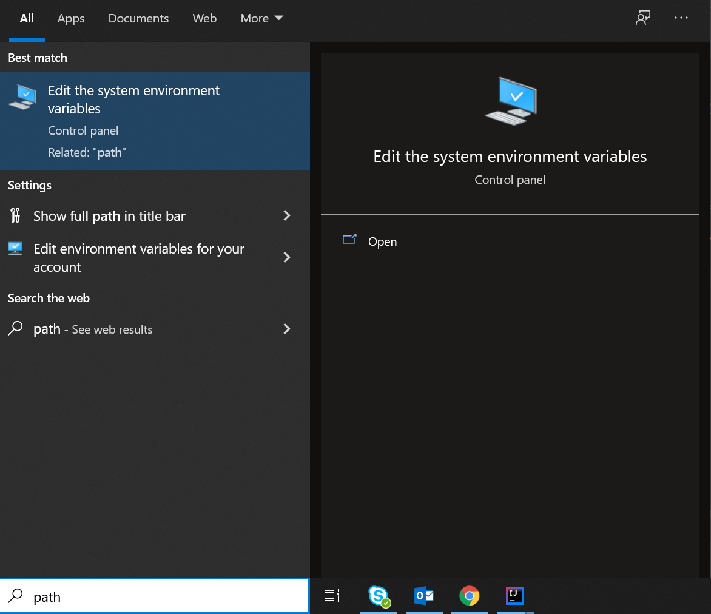

[ENG]

Hi, 

This structure you will use; It contains **UI, API, DB and XRAY connections**. In this regard, the project name has been determined as "All-In-One".

Using this structure, you can write UI - Selenium project; It can automate your APIs; With Xray implementation, you can automatically open a bug report in JIRA.

Happy coding! :) 

**A-) Pre-conditions to using:**

1) Allure-Report installations. Please contact to Automation Team for gathering documents. (How You Can Install Allure Report on Your Computer)
2) Adding jars and folders configurations such as Java and .m2 to system configurations.

To go to the location in the screenshot below; You can find it by searching "PATH" in the start menu. (Picture:1 and Picture 2)

**B-) Things to do after the project is **build**:**

1.) To execute the project, the following command line must be entered from Terminal: mvn clean -Dtestname="Your_Tag_Name" test

2.) To reaching your generated reports, open the terminal of IntelliJ or the IDE you are using and type the "allure serve" command. After that moment, you can reach your reports. Automatically generated for the project
The report will be displayed via Chrome.

[TR]

Merhaba,

Kullanacağınız bu yapı; **UI,API, DB ve XRAY bağlantılarını içerir**. Bu kapsamda proje adı "All-In-One" olarak belirlenmiştir.

Bu yapıyı kullanarak UI - Selenium projesi yazabilir, API'lerinizi otomatikleştirebilir, Xray ile JIRA'da otomatik olarak bir hata kaydı açtırabilirsiniz.

Kolay gelsin! :)

**A-) Kullanmak için ön koşullar:**

1) Allure-Rapor kurulumlarının tamamlanması gerekmektedir. İlgili dökümanlara ulaşmak için lütfen Otomasyon Ekibi ile iletişime geçin. (Allure Report'u Bilgisayarınıza Nasıl Yükleyebilirsiniz adlı döküman)
2) Java ve .m2 gibi jar ve klasör konfigürasyonlarının sistem konfigürasyonlarına eklenmesi.

Tüm bunları sisteme eklemek adına, aşağıdaki ekran görüntüsündeki konuma gidilmelidir. Bunun için; Başlat menüsünde "PATH" aratarak bulabilirsiniz. (Resim:1 ve Resim 2)

**B-) Projeden sonra yapılması gerekenler **Build**:**

1.) Projeyi çalıştırmak için aşağıdaki komut satırı Terminal'den girilmelidir: mvn clean -Dtestname="Your_Tag_Name" test 

2.) Koşum sonrası raporlara ulaşmak için, kullanmakta olduğunuz IntelliJ veya IDE'nin terminalini açıp "allure serve" komutunu yazmaktır.
Rapor, Chrome aracılığıyla görüntülenecektir.

Picture 1:

Picture 2:

