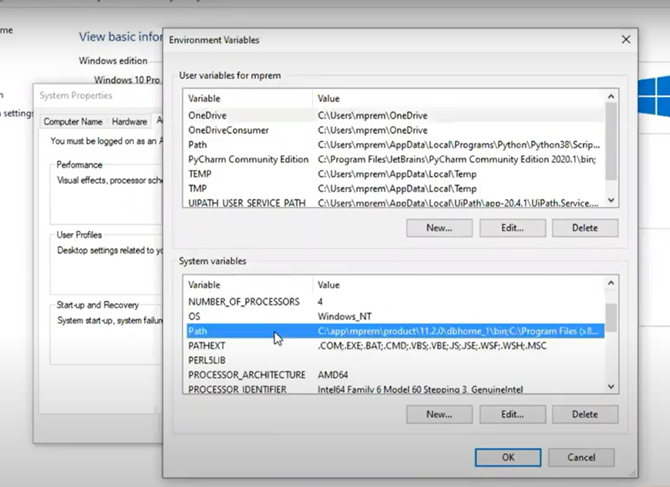

Merhaba Öncelikle :)

Bu yapı ile daha dinamik daha kontrol edilebilir bir structure hedeflemekteyiz.

Eklenmesi Gerekenler:

1) Allure projesini bilgisayara indirip konfigürasyonlara eklemek.
2)Java ve .m2 gibi jar ve klasörleri konfigürasyonları sistem konfigürasyonlarına eklemek.

   
Proje **build** olduktan sonra yapılması gerekenler:

IntelliJ veya kullandığınız IDE'nin terminal kısmını açıp "allure serve" komutunu yazmaktır. Otomatik olarak proje için oluşturulan
rapor Chrome üzerinden gösterilecektir.

   